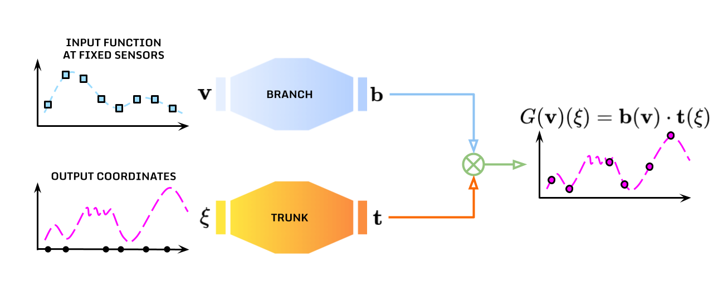

# Deep Operator Networks

This directory contains an implementation of *Deep Operator Networks* for [CTF-for-Science](https://github.com/CTF-for-Science).

*Deep Operator Networks (DeepONets)* are a class of neural operators designed to learn mappings between infinite-dimensional functional spaces. For a complete presentation see, for instance, [1,2]. Specifically, DeepONets decompose an operator into two cooperating sub-networks:
- *Branch net* that encodes input functions at a finite set of sensors,
- *Trunk net* that encodes the coordinates at which the output function is evaluated.
In formulas, the operator $G: V \to U$ between infinite-dimensional functional spaces $V$ and $U$ is approximated through the product

$$ G\left(𝘷\right)\left(\xi\right) = 𝗯\left(𝘷\right) \cdot 𝘁\left(\xi\right) $$

where $𝗯\left(𝘷\right)$ is the branch net output dependent on the input $𝘷$ (finite-dimensional inputs are typically considered relying on a finite set of sensor measurements $𝘃$ of the function $𝘷$), and $𝘁\left(\xi\right)$ is the trunk net output dependent on the coordinates $\xi$.

<br />
<p align="center" width="75%">
  
  <br />
</p>
<br />

For instance, when dealing with time-series data as taken into account by [CTF-for-Science](https://github.com/CTF-for-Science), it is possible to consider the operator

$$ G\left(u_{t-1},...,u_{t-k}\right)\left(\xi\right) = u_t\left(\xi\right) \approx 𝗯\left(𝘂_{t-1},...,𝘂_{t-k}\right) \cdot 𝘁\left(\xi\right) $$

where $k$ is the lag parameter and $\xi$ are the spatial coordinates where to predict the evolution of the function $u$. As proposed by [2, 3], the time instance $t$ or the time-step $\Delta t$ may be added to the trunk input.

## Files
- `deeponet.py`: Contains the `DeepONet` class implementing the model logic based on [DeepXDE](https://github.com/lululxvi/deepxde).
- `run.py`: Batch runner script for running the model across multiple sub-datasets in the [CTF-for-Science](https://github.com/CTF-for-Science) framework.
- `run_opt.py`: Batch runner script for running the model across multiple sub-datasets with hyperparameter tuning in the [CTF-for-Science](https://github.com/CTF-for-Science) framework.
- `optimize_parameters.py`: Script for tuning the model hyperparameters
- `config/config_Lorenz.yaml`: Configuration file for running the model on the `Lorenz` test cases for all sub-datasets.
- `config/config_KS.yaml`: Configuration file for running the model on the `Kuramoto-Sivashinsky` test cases for all sub-datasets.
- `config/optimal_config_Lorenz_*.yaml`: Configuration file for running the model on the `Lorenz` test cases with optimal hyperparameters for every sub-datasets.
- `config/optimal_config_KS_*.yaml`: Configuration file for running the model on the `Kuramoto-Sivashinsky` test cases with optimal hyperparameters for every sub-datasets.
- `tuning_config/config_Lorenz_*.yaml`: Configuration file for tuning the model hyperparameters on the `Lorenz` test cases for every sub-datasets.
- `tuning_config/config_KS_*.yaml`: Configuration file for tuning the model hyperparameters on the `Kuramoto-Sivashinsky` test cases for every sub-datasets.
 
The configuration files in the `config` folder specify the hyperparameters for running the model with the following structure
```yaml
dataset:
  name: <dataset_name>  # Test case (e.g. PDE_KS, ODE_Lorenz)
  pair_id: <pair_id>    # Which sub-datasets to consider (e.g. [1, 2, 3], 'all')
model:
  name: DeepONet
  lag: <lag_parameter>                 # Number of past values to consider in the branch net input
  branch_layers: <branch_layers>       # Number of branch net layers
  trunk_layers: <trunk_layers>         # Number of trunk net layers
  branch_neurons: <branch_neurons>     # Number of branch net neurons in every layer
  trunk_neurons: <trunk_neurons>       # Number of trunk net neurons in every layer
  activation: <activation_function>    # Activation function
  initialization: <initialization>     # Initialization of the networks
  optimizer: <optimization_algorithm>  # Optimization algorithm for training
  learning_rate: <learning_rate>       # Learning rate for training
  epochs: <epochs>                     # Number of epochs for training
  batch_size: <batch_size>             # Batch size for training
```

The configuration files in the `tuning_config` folder specify, instead, the possible hyperparameter values to explore while tuning them. 

## Usage

In the [CTF-for-Science](https://github.com/CTF-for-Science) framework, the DeepONet model can be tested with the command

```bash
python models/deeponet/run.py models/deeponet/config_*.yaml
```

## Dependencies
- numpy
- torch
- sklearn
- deepxde

[DeepXDE](https://github.com/lululxvi/deepxde) can be installed through the following commands
```bash
conda create -n deepxde
conda activate deepxde
conda install -c conda-forge pytorch deepxde
```

## References
[1] Lu L., Jin P., Pang G., Zhang Z., Karniadakis G.E., *Learning nonlinear operators via DeepONet based on the universal approximation theorem of operators*. Nature Machine Intelligence 3, 218–229 (2021). [https://doi.org/10.1038/s42256-021-00302-5](https://doi.org/10.1038/s42256-021-00302-5)

[2] Lu L., Meng X., Cai S., Mao Z., Goswami S., Zhang Z., Karniadakis G.E., *A comprehensive and fair comparison of two neural operators (with practical extensions) based on FAIR data*, Computer Methods in Applied Mechanics and Engineering 393,114778 (2022). [https://doi.org/10.1016/j.cma.2022.114778](https://doi.org/10.1016/j.cma.2022.114778)

[3] Lin G., Moya C., Zhang Z., *Learning the dynamical response of nonlinear non-autonomous dynamical systems with deep operator neural networks*, Engineering Applications of Artificial Intelligence 125, 106689 (2023). [https://doi.org/10.1016/j.engappai.2023.106689](https://doi.org/10.1016/j.engappai.2023.106689)
