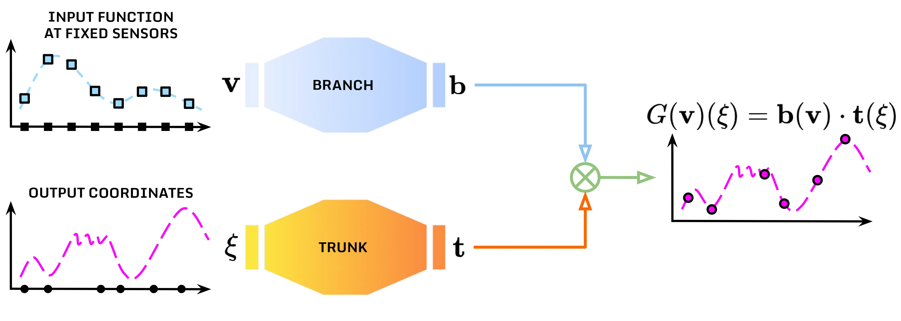

# Deep Operator Networks

This directory contains an implementation of *Deep Operator Networks* for [CTF-for-Science](https://github.com/CTF-for-Science).
*Deep Operator Networks (DeepONets)* are a class of neural operator architectures designed to learn mappings between infinite-dimensional function spaces. For a complete presentation see, for instance, [1,2]. Specifically, DeepONets decompose an operator into two cooperating sub-networks:
- *Branch net* that encodes input functions at a finite set of sensors,
- *Trunk net* that encodes the coordinates at which the output function is evaluated.
In formula, the operator $G: V \to U$ between infinite-dimensional function spaces $V$ and $U$ is approximated though the product

$$ G(𝘷)(\xi) = 𝗯(𝘷) \cdot 𝘁(\xi) $$

where $𝗯(𝘷)$ is the branch net output dependent on the input $𝘷$ (finite dimensional input are typically considered relying on a finite set of $n$ sensor measurements $𝘃$ of the function $𝘷$), and $𝘁(\xi)$ is the trunk net output dependent on the coordinates $\xi$.

<br />
<p align="center" width="75%">
  
  <br />
</p>
<br />

For instance, when dealing with time-series data as taken into account by [CTF-for-Science](https://github.com/CTF-for-Science), it is possible to consider the operator

$$ G(u_{t-1},...,u_{t-k})(\xi) = u_t(\xi) \approx 𝗯(𝘂_{t-1},...,𝘂_{t-k}) \cdot 𝘁(\xi) $$

where $k$ is the lag parameter and $\xi$ is the spatial coordinate where to predict the evolution of the function $u$. As proposed by [2, 3], the time instance $t$ or the time-step $\Delta t$ may be added to the trunk input.

## Files
- `deeponet.py`: Contains the `DeepONet` class implementing the model logic based on [DeepXDE](https://github.com/lululxvi/deepxde).
- `run.py`: Batch runner script for running the model across multiple sub-datasets in the [CTF-for-Science](https://github.com/CTF-for-Science) framework.
- `config_*.yaml`: Configuration file for running the model with problem-specific hyperparameters.

## Usage

Run the model with:

```bash
python models/deeponet/run.py models/deeponet/config_*.yaml
```

## Dependencies
- numpy
- torch
- sklearn
- deepxde

[DeepXDE](https://github.com/lululxvi/deepxde) can be installed through the following commands:
```terminal
conda create -n deepxde
conda activate deepxde
conda install -c conda-forge pytorch deepxde
```

## References
[1] Lu L., Jin P., Pang G., Zhang Z., Karniadakis G.E., *Learning nonlinear operators via DeepONet based on the universal approximation theorem of operators*. Nature Machine Intelligence 3, 218–229 (2021). [https://doi.org/10.1038/s42256-021-00302-5](https://doi.org/10.1038/s42256-021-00302-5)

[2] Lu L., Meng X., Cai S., Mao Z., Goswami S., Zhang Z., Karniadakis G.E., *A comprehensive and fair comparison of two neural operators (with practical extensions) based on FAIR data*, Computer Methods in Applied Mechanics and Engineering 393,114778 (2022). [https://doi.org/10.1016/j.cma.2022.114778](https://doi.org/10.1016/j.cma.2022.114778)

[3] Lin G., Moya C., Zhang Z., *Learning the dynamical response of nonlinear non-autonomous dynamical systems with deep operator neural networks*, Engineering Applications of Artificial Intelligence 125, 106689 (2023). [https://doi.org/10.1016/j.engappai.2023.106689](https://doi.org/10.1016/j.engappai.2023.106689)
